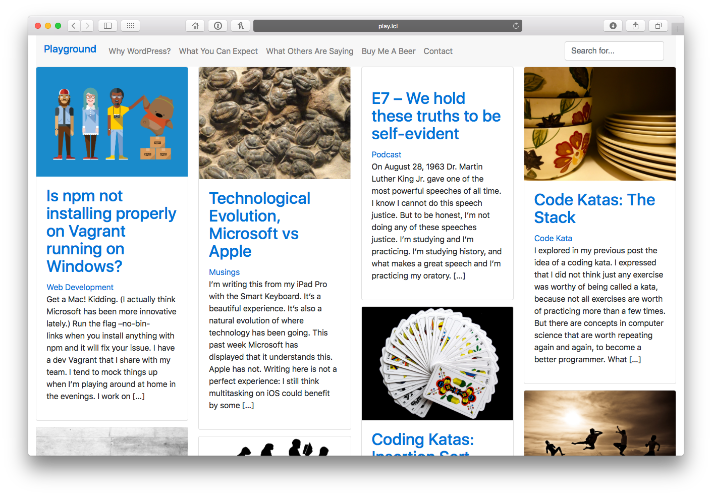

# A React+Redux WordPress theme
WordPress theme built with react calling WP-API for content.

## Why?
I wanted to play with the shiny new WP-REST-API, explore es6 and transpiling, and finally work on a full project using React+Redux.
I wrote a bit about the journey [on my blog](https://www.jackreichert.com/2017/01/developing-a-theme-for-wordpress-using-reactjs-redux-and-the-wp-rest-api/).
I'll update more about the process as I complete the *To Do* list below.

## Current Features
If you install it in WordPress v4.7 or greater it will work out of the box and have many of the features you'd want in a simple blog.

**Existing features include:**
- Dynamic menus (main menu + footer menu)
- "Template pages" equivalence for index.php, single.php, search.php, category.php... but in React/Redux
- Search
- Category archive pages
- Tags
- Bootstrap 4

## To Do
- Comments
- Widgets
- Static home page
- more...

## What does it look like?

## Want to help out?
Or do you just want to use it yourself? Be my guest. 
I'd love to see it out in the wild, so please share how you're using it. 
Sooner than later you'll see a live version on my site, so keep watch for it.